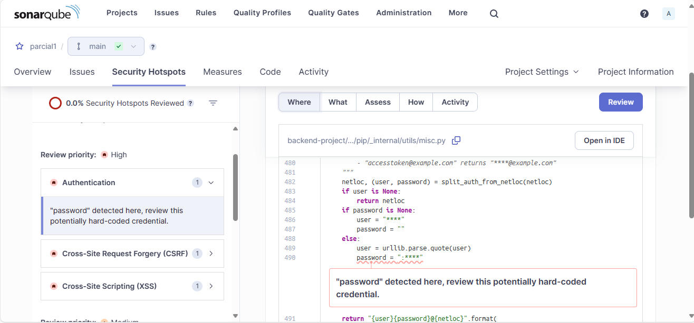

##### SONARQUBE LAB

Para ver la página de SonarQube que despliega el contenedor accedemos a la url `localhost:9000`

Se accede a la plataforma de SonarQube haciendo uso de las credenciales Login `admin` y Password `admin`, seguido a ello se debe cambiar la contraseña por defecto para poder continuar

Se crea un proyecto local, se asigna un nombre, rama principal y llave de proyecto, además se configura de forma global (por defecto)

Elegir el método de análisis local, asignar un nombre representativo del proyecto y generar el token de autenticación para usarlo con el SonarScanner

Instalar SonarScanner en el sistema operativo, en linux se hace usando `wget` y `unzip`, para ello se puede seguir esta [guía](https://medium.com/@ayoubchamchi/sonarqube-sonarscanner-8bec4711e482)

Después que el SonarScanner termina su análisis la página se recarga y muestra el dashboard del resultado del análisis

SonarQube muestra dentro de los apartados de su análisis, información sobre cada uno de los hallazgos y recomendaciónes para corregir las vulnerabilidades encontradas en el código de la aplicación. 

